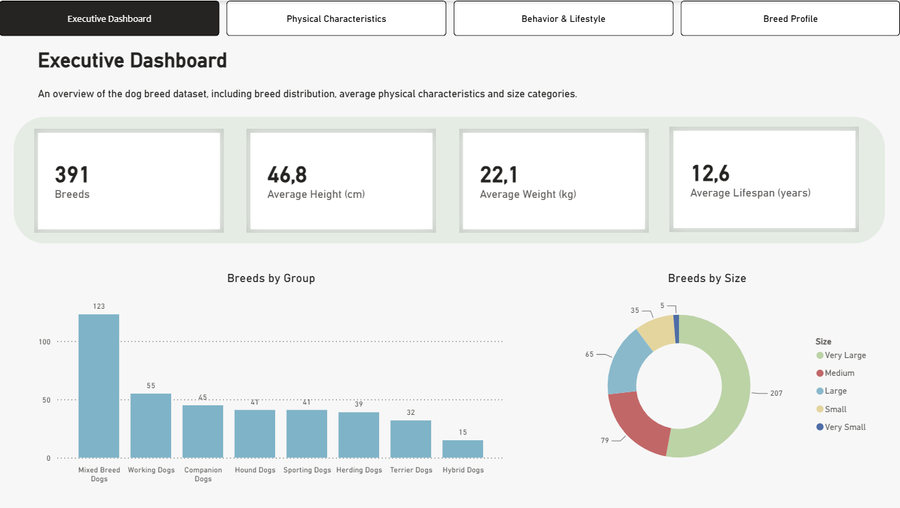
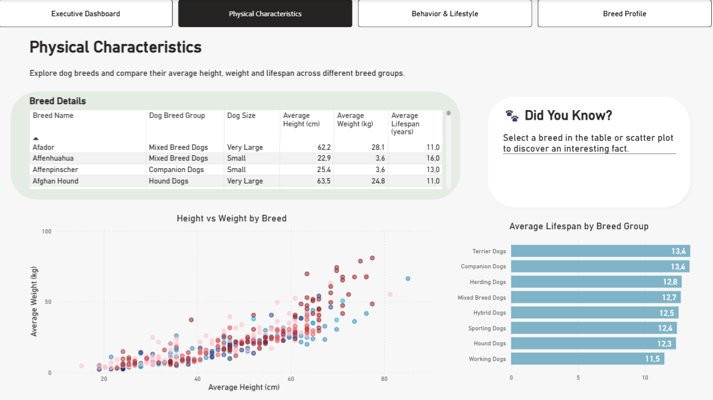
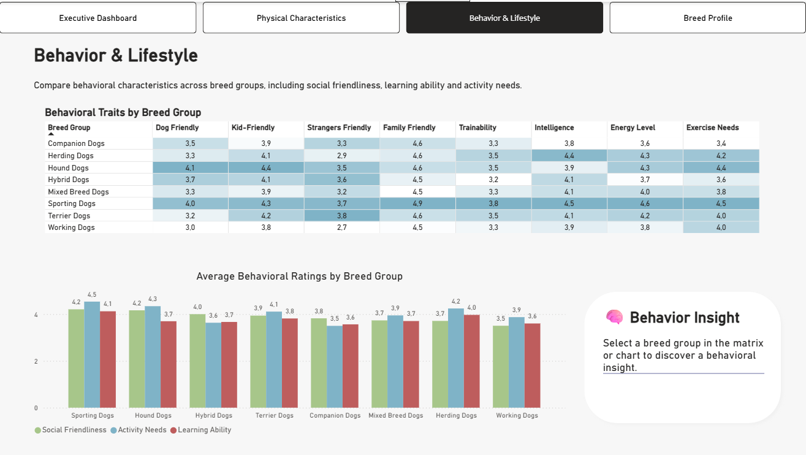
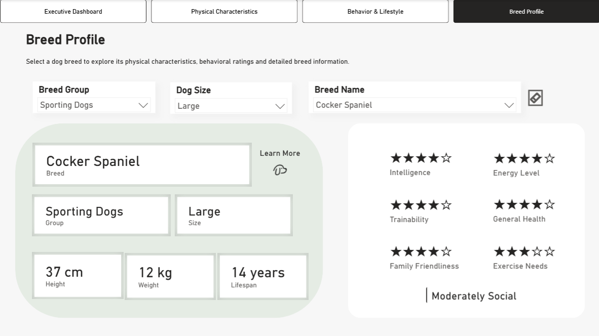

# 🐶 Dog Breeds Analysis Dashboard

Interaktivní dashboard vytvořený v **Microsoft Power BI**, který umožňuje analyzovat fyzické i behaviorální charakteristiky psích plemen.

Report vychází z datasetu obsahujícího **391 psích plemen** a nabízí přehledné vizualizace i detailní informace o jednotlivých plemenech prostřednictvím čtyř tematicky zaměřených interaktivních stránek.

Mezi analyzované oblasti patří:

- skupina plemene,
- velikost plemene,
- průměrná výška,
- průměrná hmotnost,
- průměrná délka života,
- inteligence,
- cvičitelnost,
- úroveň aktivity,
- celkový zdravotní stav,
- potřeba pohybu,
- vztah k rodině, dětem, cizím lidem a ostatním psům,
- odkaz na detailní informace o vybraném plemeni.

---

# 📊 Použitá data

Projekt využívá veřejně dostupný dataset obsahující informace o fyzických a behaviorálních vlastnostech psích plemen.

**Zdroj dat**

> https://www.kaggle.com/datasets/yonkotoshiro/dogs-breeds

Před vytvořením reportu byla data upravena v prostředí **Power Query**, kde byly zkontrolovány datové typy, odstraněny nepotřebné sloupce a připraven datový model pro následnou analýzu.

Zdrojový CSV soubor není součástí repozitáře. Pro aktualizaci dat v Power BI je potřeba stáhnout dataset z uvedeného odkazu a případně upravit cestu ke zdrojovému souboru.

---

# 📄 Struktura reportu

Report obsahuje čtyři interaktivní stránky, které uživatele postupně provedou od celkového přehledu datasetu přes analýzu fyzických a behaviorálních vlastností až k detailnímu profilu konkrétního plemene.

### 1. Executive Dashboard

<p align="center">
  
</p>

Úvodní stránka poskytuje rychlý přehled celého datasetu. Zobrazuje počet analyzovaných plemen, průměrnou výšku, průměrnou hmotnost a průměrnou délku života.

Součástí stránky je porovnání počtu plemen podle skupin a jejich rozdělení do velikostních kategorií. Slouží jako výchozí bod pro další analýzu reportu.

---

## 2. Physical Characteristics

<p align="center">
  
</p>

Stránka je zaměřena na fyzické charakteristiky jednotlivých plemen.

Umožňuje porovnávat vztah mezi průměrnou výškou a hmotností, sledovat rozdíly v délce života mezi jednotlivými skupinami plemen a zobrazit detailní údaje o konkrétních plemenech.

Součástí stránky je také dynamický panel **Did You Know?**, který zobrazuje doplňující informace vztahující se k aktuálně vybraným datům.

---

## 3. Behavior & Lifestyle

<p align="center">
  
</p>

Stránka porovnává behaviorální charakteristiky jednotlivých skupin plemen.

Analýza se soustředí na tři hlavní oblasti:

- **Social Friendliness** – vztah k rodině, dětem, cizím lidem a ostatním psům,
- **Learning Ability** – inteligence a cvičitelnost,
- **Activity Needs** – úroveň aktivity a potřeba pohybu.

Součástí stránky je dynamický panel **Behavior Insight**, který automaticky interpretuje aktuálně zobrazená data a upozorňuje na zajímavé rozdíly mezi skupinami plemen.

---

## 4. Breed Profile

<p align="center">
  
</p>

Poslední stránka nabízí detailní profil vybraného plemene.

Pomocí interaktivních filtrů lze vybírat plemeno podle skupiny, velikosti a názvu. Stránka následně zobrazuje jeho fyzické charakteristiky, průměrnou délku života a hodnocení vybraných vlastností pomocí hvězdičkového systému.

Součástí profilu je také slovní interpretace společenskosti plemene a tlačítko **Learn More**, které odkazuje na externí stránku s podrobnějšími informacemi.

Tlačítko **Reset Filters** umožňuje rychle vymazat všechny aktivní filtry na stránce.

---

# 🗂️ Datový model

Projekt využívá jednoduché **hvězdicové schéma (Star Schema)**.

Datový model je tvořen hlavní tabulkou `Dogs`, dvěma dimenzními tabulkami a samostatnou tabulkou pro správu DAX measures.

### Použité tabulky

- `Dogs` – hlavní tabulka obsahující informace o jednotlivých plemenech,
- `Breed Groups` – dimenzní tabulka obsahující jedinečné skupiny plemen,
- `Dog Sizes` – dimenzní tabulka obsahující jedinečné velikostní kategorie,
- `Measure Table` – samostatná tabulka obsahující všechny DAX measures.

Tabulky `Breed Groups` a `Dog Sizes` jsou propojeny s hlavní tabulkou `Dogs` pomocí relací typu **1:N**.

```text
Breed Groups (1)
        │
        ▼
      Dogs (*)
        ▲
        │
 Dog Sizes (1)

Measure Table
```

Toto řešení zajišťuje přehledný datový model, správné filtrování mezi tabulkami a jednodušší správu reportu.

---

# 🧮 DAX výpočty

Projekt obsahuje vlastní DAX measures využívané pro tvorbu KPI ukazatelů, dynamických textů a interaktivních prvků reportu.

Mezi hlavní výpočty patří například:

- Total Breeds
- Average Height
- Average Weight
- Average Lifespan
- Average Social Friendliness
- Average Learning Ability
- Average Activity Needs
- Behavior Insight
- Fun Fact

Součástí projektu je také kalkulovaný sloupec **Family Friendliness Category**, který rozděluje plemena podle úrovně společenskosti do kategorií:

- Highly Social
- Moderately Social
- Less Social

Tato informace je následně zobrazena v detailním profilu vybraného plemene.

---

# ⚙️ Použité technologie

| Technologie | Využití |
|-------------|----------|
| Microsoft Power BI Desktop | Tvorba datového modelu, reportu a vizualizací |
| Power Query | Čištění, transformace a příprava dat |
| DAX | Výpočty, KPI ukazatele a dynamické prvky |
| GitHub | Správa verzí a dokumentace projektu |

---

# ✨ Klíčové funkce reportu

- interaktivní filtrování pomocí slicerů,
- navigace mezi jednotlivými stránkami,
- vzájemné filtrování vizualizací,
- dynamické KPI ukazatele,
- dynamické textové panely,
- detailní profil vybraného plemene,
- hvězdičkové hodnocení vlastností,
- slovní interpretace společenskosti,
- externí odkaz na detailní informace o plemeni,
- tlačítko pro vymazání všech filtrů.

---

# 📈 Použité vizualizace

Report využívá několik typů vizualizací:

- KPI karty,
- seskupený sloupcový graf,
- prstencový graf,
- bodový graf,
- tabulku,
- matici,
- slicery,
- textové karty,
- navigační a akční tlačítka.

---

# 📁 Struktura repozitáře

```text
Dog-Breeds-Analysis/
│
├── Dog_Breeds_Analysis.pbix
├── README.md
│
└── images/
    ├── 01-executive-dashboard.png
    ├── 02-physical-characteristics.png
    ├── 03-behavior-lifestyle.png
    └── 04-breed-profile.png
```
